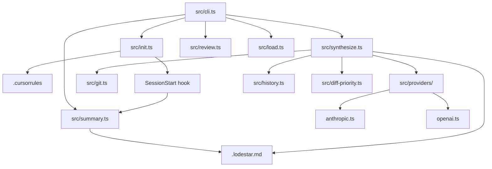

# Lodestar Context

> Project: lodestar
> Date: 2026-03-27
> Model: claude-3-5-sonnet

## Project Summary

Lodestar is a CLI + MCP tool that synthesizes AI coding session context into a structured .lodestar.md file, enabling any AI coding tool (Claude Code, Cursor, Windsurf) to resume with full architectural context. It captures git diffs, decisions, patterns, rejected approaches, and open questions across sessions, and provides a browser-based reader for reviewing session history. The core insight: code is always saved; the thinking behind it isn't. Lodestar closes that gap by persisting session reasoning to the repo.

**User Segments:**
- Solo founders using AI coding tools
- Developers working with AI pair programmers (Claude, Cursor, Windsurf, Copilot)
- First-time app builders who lose context between sessions

## Integrations

- **Anthropic Claude API** [api] — LLM provider for session synthesis and brief generation
- **OpenAI API** [api] — Alternative LLM provider for session synthesis
- **Cursor IDE** [api] — Auto-bootstrap MCP tool registration and .cursorrules injection

## Project Brief Status

- [x] **lodestar init — first-run CLI wizard** — 100%
  - ✓ provider setup
  - ✓ key validation
  - ✓ tool auto-config
  - ✓ git hooks
  - ✓ SessionStart hook
  - ✓ .cursorrules
- [x] **lodestar_synthesize — session synthesis via LLM** — 100%
  - ✓ two-diff capture
  - ✓ brief diff separation
  - ✓ priority-based truncation
  - ✓ model routing (Haiku/Sonnet)
  - ✓ no-changes detection
  - ✓ evidence-based question verification
  - ✓ session notes accumulator
- [x] **lodestar_load — structured context loader** — 100%
  - ✓ auto-bootstrap on first start
  - ✓ bootstrapped context detection
- [x] **lodestar review — browser-based session reader** — 100%
  - ✓ live refresh polling
  - ✓ Mermaid diagrams
  - ✓ click-to-enlarge
  - ✓ Pro placeholders
  - ✓ 3-tab layout
- [-] **Terminal summary — distilled session briefing** — 90% — Updated via commit: feat: automatic session management — SessionStart + SessionE
  - ✓ 5-line briefing
  - ✓ SessionStart hook
- [x] **Cursor AI integration** — 100%
  - ✓ MCP tool registration
  - ✓ .cursorrules auto-write
  - ✓ trigger phrases
- [-] **lodestar diff — drift detection** — 65%

## Future Phases

### Phase 1b

Drift detection and extended tooling
- lodestar diff — detect drift between current codebase state and last synthesis
- lodestar start — explicit session-start command for Cursor/Windsurf users without SessionStart hook support
- Passive background watching or automatic session-end synthesis (Phase 2+)

## Diagrams

### System Architecture [architecture]

## Decisions

### Lodestar is a codebase feature, not a Claude Code feature — works with any AI coding tool (Cursor, Windsurf, Claude Code)

**Rationale:** Broadens utility and removes tool lock-in. Phase 1a focuses on Claude Code SessionStart hook; Phase 1b adds explicit lodestar start command for tools without hook mechanisms.
**Files:** CLAUDE.md

### Terminal summary as momentum layer (auto-printed), lodestar review as depth layer (manual browser tool) — two surfaces, two jobs

**Rationale:** SessionStart hook must be fast and frictionless (5-10 seconds max); full context reconstruction belongs in a manual browser tool. Terminal summary prints distilled nextSession bullets, most recent rejection, and blocking questions to stderr; lodestar review provides full .lodestar.md visualization.
**Files:** CLAUDE.md, src/summary.ts, src/init.ts

### Brief files (CLAUDE.md, PRD.md, BRIEF.md) are captured and processed separately from code diffs

**Rationale:** Brief changes represent high-level product/architectural decisions that should be treated as first-class inputs to synthesis, not secondary to code changes. Separating them prevents code diffs from consuming token budget and makes decision-level changes visible in their own channel.
**Files:** src/git.ts, src/synthesize.ts, prompts/synthesize.md

### HTML reader page is fully self-contained — all CSS, JS, and data inline in a single string

**Rationale:** Works offline, no CDN calls, no build step for the reader, no external runtime dependencies. Client polls /check endpoint every 5s to detect .lodestar.md changes.
**Files:** src/reader/template.ts, src/review.ts

### Synthesis captures two distinct diffs: uncommitted changes and committed changes since last synthesis

**Rationale:** Developers who commit frequently mid-session were losing committed work — the old single git diff HEAD only showed unstaged/staged changes. The anchor point is the most recent commit that touched .lodestar.md.
**Files:** src/git.ts, src/synthesize.ts

### Feature capabilities are tracked as structured sub-items with individual status (done/in-progress/planned)

**Rationale:** Enables granular progress tracking within features and clearer visibility into what specifically was built each session. Capabilities are persisted in schema and rendered in both markdown and terminal output.
**Files:** src/schema.ts, src/cli.ts

## Patterns

- **Provider abstraction under src/providers/ — each provider (anthropic.ts, openai.ts, ollama.ts) implements a unified interface with model override parameter** — src/providers/
- **Prompts stored as markdown files in prompts/ and loaded at runtime with {{variable_name}} template substitution** — prompts/synthesize.md, src/synthesize.ts
- **History stored in .lodestar.history/ at working directory root, gitignored; .lodestar.md committed to repo serves as the anchor marker for findLastSynthesisCommit()** — .gitignore, src/history.ts, src/git.ts
- **CLI commands loaded lazily via dynamic import() in cli.ts switch statement — avoids loading all modules on every invocation** — src/cli.ts
- **Reader HTTP server uses async request handler to regenerate data on each request, with idle timeout for cleanup and client-side polling via fetch('/check')** — src/review.ts, src/reader/template.ts

## Dependencies

- **simple-git** — Git diff and history utilities
- **@anthropic-ai/sdk** — Anthropic Claude API client
- **openai** — OpenAI API client

## Rejected Approaches

### Using a markdown library (marked, markdown-it) for PRD content rendering in the reader

**Reason:** Would require bundling or a CDN call from the served page, both of which violate the no-external-dependencies constraint on the self-contained HTML reader

### Using only git diff HEAD (uncommitted changes) as the sole input to synthesis

**Reason:** Developers who commit mid-session lose all committed work from synthesis. A session with 5 commits and no uncommitted changes would produce an empty diff and a useless synthesis

### Persistent web server or cloud-hosted UI for lodestar review

**Reason:** Explicitly out of scope. A short-lived local server avoids port conflicts, background processes, and infrastructure requirements

### Binary-search head-truncation of the full diff string

**Reason:** Cuts diffs mid-file, producing partial hunks that are hard to interpret. Replaced by file-boundary splitting in src/diff-priority.ts which drops whole low-priority files instead

## Open Questions

No open questions.

## Next Session

No next-session notes.
