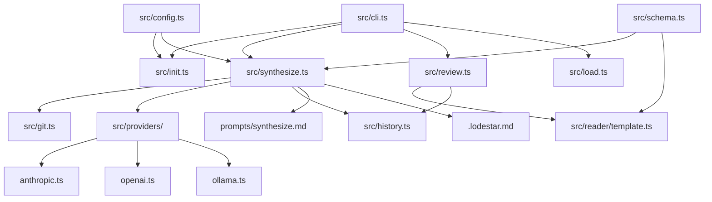
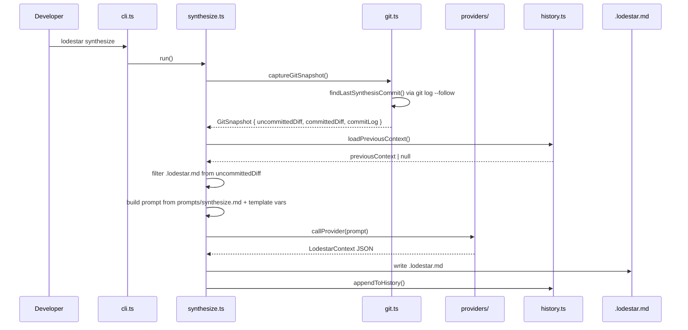

# Lodestar Context

> Project: lodestar
> Date: 2026-03-24
> Model: claude-opus-4-5

## Project Summary

Lodestar is a CLI + MCP tool that synthesizes coding session context into a structured .lodestar.md file, enabling AI assistants and developers to resume sessions with full context. It captures git diffs, decisions, patterns, and open questions across sessions, and provides a browser-based reader for reviewing session history.

**User Segments:**
- Solo founders using AI coding tools
- Developers working with AI pair programmers (Claude, Cursor, Copilot)
- First-time app builders who lose context between sessions

## Integrations

No integrations detected.

## Project Brief Status

- [x] **lodestar init — first-run CLI wizard** — 95% — Provider selection, key validation, config creation, retry on invalid directory, and skip-prompt-if-valid-config all implemented.
- [x] **lodestar synthesize — two-diff session synthesis** — 100% — Updated via commit: chore: update session context
- [-] **lodestar load — structured context loader** — 90% — Updated via commit: chore: update session context
- [x] **lodestar review — browser-based session reader** — 100% — Updated via commit: chore: update session context
- [ ] **lodestar diff — drift detection** — 15% — Updated via commit: feat: lodestar bootstrap — zero-cost onboarding for existing

## Future Phases

### Phase 1b

Drift detection and diff tooling
- lodestar diff — detect drift between current codebase state and last synthesis

## Diagrams

### System Architecture [architecture]

### Synthesize Flow [sequence]

## Decisions

### Synthesis captures two distinct diffs: uncommitted changes and committed changes since last synthesis

**Rationale:** Developers who commit frequently mid-session were losing committed work — the old single git diff HEAD only showed unstaged/staged changes. The anchor point is the most recent commit that touched .lodestar.md, found via git log --follow.
**Files:** src/git.ts, src/synthesize.ts, prompts/synthesize.md

### .lodestar.md is excluded from the uncommitted diff check in synthesize.ts

**Rationale:** Without this filter, synthesize would see its own output file as an uncommitted change and treat it as a meaningful source change, causing false positives on hasUncommitted. The file is filtered line-by-line before the empty-string check.
**Files:** src/synthesize.ts

### HTML reader page is fully self-contained — all CSS, JS, and data inline in a single string from src/reader/template.ts

**Rationale:** Works offline, no CDN calls, no build step for the reader, no external runtime dependencies.
**Files:** src/reader/template.ts, src/review.ts

### markdownToHtml() implemented as a custom inline renderer rather than importing a markdown library

**Rationale:** The reader page is fully self-contained with no external dependencies. Importing marked or markdown-it would require bundling or a CDN call, both of which violate the self-contained HTML constraint.
**Files:** src/reader/template.ts

### futurePhases added as a top-level array in LodestarContext schema

**Rationale:** Surfaces planned future work as structured data rather than burying it in decisions or open questions, allowing the reader to render upcoming phases as a distinct section.
**Files:** src/schema.ts, prompts/synthesize.md

## Patterns

- **Provider abstraction under src/providers/ — each provider (anthropic.ts, openai.ts, ollama.ts) implements a unified interface** — src/providers/
- **Prompts stored as markdown files in prompts/ and loaded at runtime with {{variable_name}} template substitution** — prompts/synthesize.md, src/synthesize.ts
- **History stored in .lodestar.history/ at working directory root, gitignored; .lodestar.md committed to repo serves as the anchor marker for findLastSynthesisCommit()** — .gitignore, src/history.ts, src/git.ts
- **CLI commands loaded lazily via dynamic import() in cli.ts switch statement — avoids loading all modules on every invocation** — src/cli.ts

## Dependencies

No dependency changes recorded.

## Rejected Approaches

### Using a markdown library (marked, markdown-it) for PRD content rendering in the reader

**Reason:** Would require bundling or a CDN call from the served page, both of which violate the no-external-dependencies constraint on the self-contained HTML reader.

### Using only git diff HEAD (uncommitted changes) as the sole input to synthesis

**Reason:** Developers who commit mid-session lose all committed work from synthesis. A session with 5 commits and no uncommitted changes would produce an empty diff and a useless synthesis.

### Persistent web server or cloud-hosted UI for lodestar review

**Reason:** Explicitly out of scope per CLAUDE.md. A short-lived local server avoids port conflicts, background processes, and infrastructure requirements.

### WebSocket or SSE live reload in the review server

**Reason:** Explicitly rejected per spec. The reader is single-use, not a dev server.

## Open Questions

- [BLOCKING] Does markdownToHtml() in template.ts have a bug where markdown symbols are HTML-escaped by escapeHtml() before the markdown regexes run, causing regexes to never match?

## Next Session

No next-session notes.
