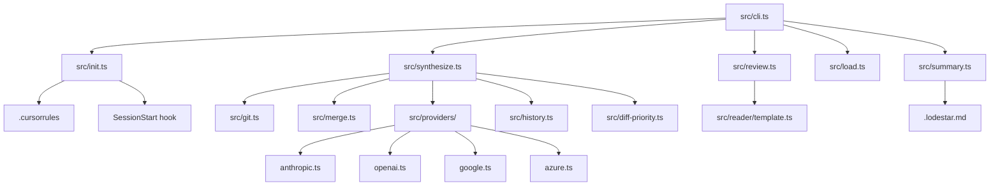
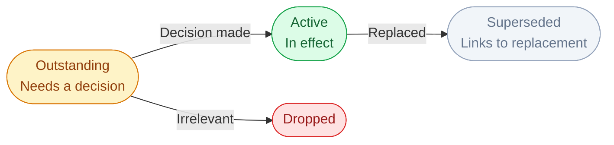
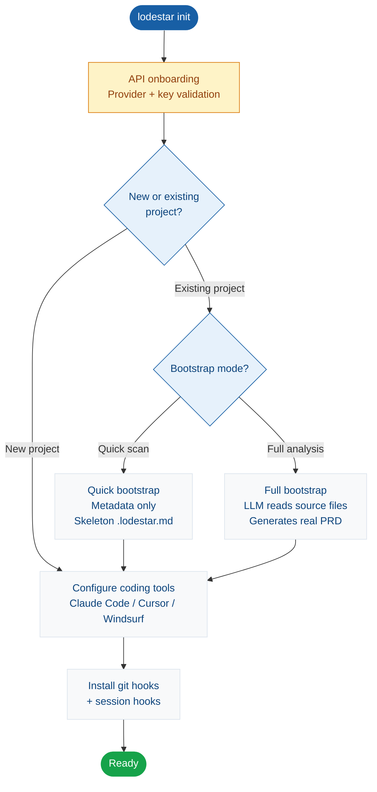

# Lodestar Context

> Project: lodestar
> Date: 2026-03-29
> Model: claude-opus-4-5

## Project Summary

Lodestar is a CLI + MCP tool that synthesizes AI coding session context into a structured .lodestar.md file, enabling any AI coding tool (Claude Code, Cursor, Windsurf) to resume with full architectural context. It captures git diffs, decisions, patterns, rejected approaches, and open questions across sessions, and provides a browser-based reader for reviewing session history. The core insight: code is always saved; the thinking behind it isn't. Lodestar closes that gap by persisting session reasoning to the repo.

**User Segments:**
- Solo founders using AI coding tools
- Developers working with AI pair programmers (Claude, Cursor, Windsurf, Copilot)
- First-time app builders who lose context between sessions

## Integrations

- **Anthropic Claude API** [api] — LLM provider for session synthesis and brief generation (default)
- **OpenAI API** [api] — Alternative LLM provider for session synthesis
- **Google Generative AI** [api] — Alternative LLM provider for session synthesis via Gemini
- **Azure OpenAI** [api] — Alternative LLM provider for session synthesis
- **Cursor IDE** [api] — Auto-bootstrap MCP tool registration and .cursorrules injection

## Project Brief Status

- [x] **lodestar init — first-run CLI wizard** — 100%
  - ✓ provider setup
  - ✓ key validation
  - ✓ tool auto-config
  - ✓ git hooks
  - ✓ SessionStart hook
  - ✓ .cursorrules generation
  - ✓ Provider setup with multi-provider selection (Anthropic, OpenAI, Google, Azure)
  - ✓ API key validation
  - ✓ Tool auto-config for Claude Code, Cursor, Windsurf
  - ✓ Git hooks installation
  - ✓ SessionStart/SessionEnd hook configuration
  - ✓ Provider setup with multi-provider selection
  - ✓ Google Gemini and Azure OpenAI provider support
- [-] **lodestar_synthesize — session synthesis via LLM** — 90% — Core synthesis complete. Google and Azure provider files added (untracked) — not yet committed or verified end-to-end.
  - ✓ Two-diff capture (uncommitted + committed)
  - ✓ brief diff separation
  - ✓ Priority-based truncation
  - ✓ Model routing (Haiku/Sonnet)
  - ✓ No-changes detection
  - ✓ Evidence-based question verification
  - ✓ Session notes accumulator
  - ✓ two-diff capture
  - ✓ Context merge layer
  - ✓ model routing
  - ○ Google Gemini provider
  - ○ Azure OpenAI provider
  - ✓ Brief diff separation (CLAUDE.md, PRD.md)
  - ○ Google Gemini provider implementation
  - ○ Azure OpenAI provider implementation
- [x] **lodestar_load — structured context loader** — 100%
  - ✓ Auto-bootstrap on first start
  - ✓ Bootstrapped context detection
- [x] **lodestar review — browser-based session reader** — 100% — Path resolution completed; template receives resolved path object. Logo attribution footer added.
  - ✓ Live refresh polling
  - ✓ Mermaid diagrams with click-to-enlarge
  - ✓ 3-tab layout (summary, history, features)
  - ✓ Pro feature placeholders
  - ✓ Architecture diagram auto-collapse after render
  - ✓ Project name display with path shortening
  - ✓ Logo attribution footer
  - ✓ Decision status lifecycle rendering (active/superseded/outstanding)
  - ✓ Decision grouping and session tracking
  - ✓ 3-tab layout
  - ✓ Decision status lifecycle rendering
  - ✓ path resolution passed to template
  - ✓ Architecture diagram auto-collapse
  - ✓ path resolution to template
  - ✓ Resolved path object passed to template
- [-] **Terminal summary — distilled session briefing** — 95% — Core functionality complete; edge case polish remaining.
  - ✓ 5-line briefing generation
  - ✓ SessionStart hook integration
  - ○ Edge case polish
- [x] **Cursor AI integration** — 100%
  - ✓ MCP tool registration
  - ✓ .cursorrules auto-write
  - ✓ Trigger phrases
- [-] **lodestar diff — drift detection** — 65% — Drift detection logic not yet implemented.
  - · Drift detection between current codebase and last synthesis
- [-] **Multi-provider expansion (Google, Azure)** — 50% — src/providers/google.ts and src/providers/azure.ts added as untracked files. @google/generative-ai package added to package.json. Not yet committed — requires verification against LLMProvider interface and end-to-end testing.
  - ○ Google Gemini provider implementation
  - ○ Azure OpenAI provider implementation
  - ○ Provider index registration
  - ○ Google Gemini provider file
  - ○ Azure OpenAI provider file
  - ○ Init wizard provider selection for Google/Azure
  - · End-to-end synthesis routing for Google/Azure

## Future Phases

### Phase 1b

Drift detection, onboarding, and adaptive synthesis
- lodestar diff — complete drift detection between current codebase and last synthesis
- lodestar start — explicit session-start command for Cursor/Windsurf users without SessionStart hook support
- Terminal summary edge case polish to reach 100%
- Full bootstrap mode — LLM reads source files to generate real PRD from existing code
- Restructured lodestar init flow — API onboarding first, new/existing fork, bootstrap mode selection
- Project preferences file (.lodestar.preferences) — user and auto-learned rules appended to synthesis prompt.
- Project preferences file (.lodestar.preferences) — user and auto-learned rules appended to synthesis prompt.
- Project preferences file (.lodestar.preferences) — user and auto-learned rules appended to synthesis prompt.
- Project preferences file (.lodestar.preferences) — user and auto-learned rules appended to synthesis prompt.
- Project preferences file (.lodestar.preferences) — user and auto-learned rules appended to synthesis prompt.
- Project preferences file (.lodestar.preferences) — user and auto-learned rules appended to synthesis prompt. Zero extra LLM calls.
- Edit diffing — compare .lodestar.history/ against current .lodestar.md before synthesis, generate correction notes for the prompt. Zero extra LLM calls.

### Phase 2+

Passive automation, cloud features, and adaptive intelligence
- Passive background watching or automatic session-end synthesis
- Cloud-hosted review UI — shareable URL, no local server required
- Cross-session synthesis quality scoring — % of decisions surviving without edits, % of questions deleted, diagram correction rate. Uses telemetry + periodic Haiku analysis call (~1 per 5 sessions, ~$0.0004/session).
- Auto-tuned preferences — scoring data auto-generates preference updates, closing the feedback loop. 'Lodestar grows with you.'

## Diagrams

### System Architecture [architecture]

### Decision Lifecycle [flow]

### lodestar init Flow [flow]

## Decisions

### Tool-agnostic positioning — Lodestar is a codebase feature, not a Claude Code feature
**Status:** active
**Group:** Product & Business
**Session:** 2026-03-15
**Rationale:** Broadens utility and removes tool lock-in. Works with Claude Code, Cursor, Windsurf, or any AI coding tool.

### Binary-only distribution — no source code released
**Status:** active
**Group:** Product & Business
**Session:** 2026-03-18
**Rationale:** Implementation moat is opacity — synthesis prompt, schema design, provider abstraction, history rotation, and review UX are all protected.

### Pro tier uses capability gating — not content blur or depth gating
**Status:** active
**Group:** Product & Business
**Session:** 2026-03-20
**Rationale:** .lodestar.md is a local text file — any blur is bypassed with `cat`. Pro gates features requiring server-side infrastructure.

### Review --diff is a Pro-only feature
**Status:** active
**Group:** Product & Business
**Session:** 2026-03-20
**Rationale:** Session comparison panel is the highest-value Pro conversion trigger. Free tier shows full current-session content; only cross-session comparison is gated.

### Two-track GTM: GitHub Releases (virality) + kylex.io (email capture via Beehiiv)
**Status:** active
**Group:** Product & Business
**Session:** 2026-03-18
**Rationale:** GitHub track drives stars and word of mouth with zero email gate. Kylex.io track drives newsletter subscribers via single opt-in.

### EULA required before any binary ships
**Status:** outstanding
**Group:** Product & Business
**Session:** 2026-03-18
**Rationale:** Binary is legally unprotected without it. Must cover: no reverse engineering, no redistribution, single-user licence, telemetry disclosure, auto-update disclosure.

### Anonymous telemetry permitted — opt-out available
**Status:** active
**Group:** Product & Business
**Session:** 2026-03-18
**Rationale:** Binary distribution makes telemetry possible. Tracks: sessions/week, provider used, synthesis success/failure. No PII, no project content. Disclosed in EULA.

### Decisions are permanent history — synthesis can add and update status, never delete
**Status:** active
**Group:** Core Architecture
**Session:** 2026-03-29
**Rationale:** Decisions are the product. Merge layer unions previous + new, allows status changes, never drops entries.
**Files:** src/schema.ts, src/merge.ts, src/reader/template.ts

### Synthesis uses merge-not-overwrite — LLM output reconciled with existing context
**Status:** active
**Group:** Core Architecture
**Session:** 2026-03-29
**Rationale:** Merge layer between LLM output and file write. Decisions accumulate with status updates, diagrams append-only, features update in place, open questions and nextSession take new values. Prevents loss of user-authored data across synthesis cycles.
**Files:** src/merge.ts, src/synthesize.ts

### HTML reader page is fully self-contained — all CSS, JS, and data inline
**Status:** active
**Group:** Core Architecture
**Session:** 2026-03-18
**Rationale:** Works offline, no CDN calls, no build step, no external runtime dependencies.
**Files:** src/reader/template.ts, src/review.ts

### Synthesis captures two distinct diffs: uncommitted + committed since last synthesis
**Status:** active
**Group:** Core Architecture
**Session:** 2026-03-20
**Rationale:** Developers who commit mid-session were losing committed work. Anchor point is the most recent commit that touched .lodestar.md.
**Files:** src/git.ts, src/synthesize.ts

### Single git diff HEAD as sole input to synthesis
**Status:** superseded
**Group:** Core Architecture
**Session:** 2026-03-15
**Rationale:** Original approach. Worked for single-commit sessions but developers who commit mid-session lost all committed work.
**Superseded by:** Synthesis captures two distinct diffs: uncommitted + committed since last synthesis

### Haiku for mid-session checkpoints, Sonnet for end-of-session synthesis
**Status:** active
**Group:** Core Architecture
**Session:** 2026-03-20
**Rationale:** Mid-session needs file inventory only — Haiku handles at 1/3 cost. End-of-session needs rationale extraction — Sonnet scores 9.1/10 vs Haiku 5.9/10.

### Auto-update via GitHub Releases API — no backend required
**Status:** active
**Group:** Core Architecture
**Session:** 2026-03-18
**Rationale:** Lightweight GET on every invocation, compare tag_name against binary version. Non-blocking notice.

### Decision statuses: active, superseded, outstanding — one direction forward
**Status:** active
**Group:** Synthesis & Context
**Session:** 2026-03-29
**Rationale:** Outstanding → Active → Superseded. No backward movement. 'Revisited' rejected as recursive.

### Brief files (CLAUDE.md, PRD.md) captured separately from code diffs
**Status:** active
**Group:** Synthesis & Context
**Session:** 2026-03-20
**Rationale:** Brief changes are high-level product decisions — first-class inputs to synthesis, not secondary to code.
**Files:** src/git.ts, src/synthesize.ts

### Feature capabilities tracked as structured sub-items with individual status
**Status:** active
**Group:** Synthesis & Context
**Session:** 2026-03-22
**Rationale:** Granular progress tracking within features. Capabilities persisted in schema and rendered in both markdown and terminal output.
**Files:** src/schema.ts

### Provider-agnostic synthesis via LLMProvider interface
**Status:** active
**Group:** Synthesis & Context
**Session:** 2026-03-15
**Rationale:** Anthropic default, OpenAI, Google, and Azure as alternatives. Same prompt across all providers.
**Files:** src/providers/

### API key configured via lodestar init wizard — not .env or manual editing
**Status:** active
**Group:** Synthesis & Context
**Session:** 2026-03-18
**Rationale:** Stored in ~/.lodestar.config.json. Never in project repo, never via .env in production.
**Files:** src/init.ts, src/config.ts

### lodestar init flow: API onboarding first, then new/existing fork, then bootstrap mode
**Status:** active
**Group:** Onboarding
**Session:** 2026-03-29
**Rationale:** API key gates everything. Existing projects choose quick or full bootstrap. New projects skip bootstrap.
**Files:** src/init.ts

### Manual start/end commands for session lifecycle
**Status:** superseded
**Group:** Onboarding
**Session:** 2026-03-15
**Rationale:** Original flow: user runs lodestar start/end manually. Worked but added friction. Replaced by automatic hooks.
**Superseded by:** Auto-save via git hooks and SessionStart/SessionEnd hooks

### Full bootstrap mode: LLM reads source files to generate real PRD
**Status:** outstanding
**Group:** Onboarding
**Session:** 2026-03-29
**Rationale:** Current bootstrap is metadata-only with [UNKNOWN] fields. Existing code has enough signal for a real project brief.
**Files:** src/bootstrap.ts

### Terminal summary as momentum layer, lodestar review as depth layer — two surfaces, two jobs
**Status:** active
**Group:** UI & Display
**Session:** 2026-03-15
**Rationale:** Terminal fires automatically (10 seconds, zero interaction). Review is manual browser tool for full context.
**Files:** src/summary.ts, src/review.ts

### Project path shortening in reader header (home as ~, last 2 segments)
**Status:** active
**Group:** UI & Display
**Session:** 2026-03-29
**Rationale:** Prevents header overflow while maintaining project identification.
**Files:** src/reader/template.ts

### Provider-agnostic synthesis via LMProvider interface
**Status:** active
**Group:** Synthesis & Context
**Session:** 2026-03-29
**Rationale:** Anthropic default, OpenAI and Ollama as alternatives. Same prompt across all providers.
**Files:** src/providers/

### Resolved path object passed to renderReaderHTML for template context awareness
**Status:** active
**Group:** UI & Display
**Session:** 2026-03-29
**Rationale:** Template needs access to absolute and relative path information for project identification, file linking, and history reference. Path resolution done in review handler, not in template.
**Files:** src/review.ts, src/reader/template.ts

### Logo attribution footer added to reader UI
**Status:** active
**Group:** UI & Display
**Session:** 2025-04-21
**Rationale:** Brand acknowledgment and attribution for designer credit (Kylex). Asymmetric Polaris star mark with wordmark and micro attribution.
**Files:** assets/logo.svg

### Adaptive synthesis — Free gets manual preferences, Pro gets "grows with you"
**Status:** outstanding
**Group:** Product & Business
**Session:** 2026-03-29
**Rationale:** Free tier: project preferences file (.lodestar.preferences) — user edits manually, static rules appended to prompt, zero extra LLM calls. Pro tier: edit diffing + cross-session scoring — Lodestar detects corrections and adapts automatically. Fits existing capability gating strategy. Pro cost ~$0.0004/session for periodic Haiku scoring call — negligible against checkpoint budget.

### Expand LLM provider support to include Google Gemini and Azure OpenAI
**Status:** active
**Group:** Core Architecture
**Session:** 2025-04-22
**Rationale:** Reduces provider lock-in and broadens market reach. Google and Azure are common enterprise choices. Same LLMProvider interface used — zero synthesis code changes required.
**Files:** src/providers/google.ts, src/providers/azure.ts, src/providers/index.ts

### Adaptive synthesis — Free gets manual preferences, Pro gets 'grows with you'
**Status:** outstanding
**Group:** Product & Business
**Session:** 2026-03-29
**Rationale:** Free tier: project preferences file (.lodestar.preferences) — user edits manually, static rules appended to prompt, zero extra LLM calls. Pro tier: edit diffing + cross-session scoring — Lodestar detects corrections and adapts automatically. Fits existing capability gating strategy. Pro cost ~$0.0004/session for periodic Haiku scoring call — negligible against checkpoint budget.

## Patterns

- **Provider abstraction under src/providers/ — each provider (anthropic.ts, openai.ts, ollama.ts) implements a unified interface with model override parameter** — src/providers/
- **Prompts stored as markdown files in prompts/ and loaded at runtime with {{variable_name}} template substitution** — prompts/, src/synthesize.ts
- **History stored in .lodestar.history/ at working directory root, gitignored; .lodestar.md committed to repo serves as the anchor marker for findLastSynthesisCommit()** — .gitignore, src/history.ts, src/git.ts
- **CLI commands loaded lazily via dynamic import() in cli.ts switch statement — avoids loading all modules on every invocation** — src/cli.ts
- **Reader HTTP server uses async request handler to regenerate data on each request, with idle timeout for cleanup and client-side polling via fetch('/check')** — src/review.ts, src/reader/template.ts
- **Merge layer (src/merge.ts) between LLM synthesis output and file write — unions decisions, preserves diagrams, updates features in place, replaces open questions and nextSession** — src/merge.ts, src/synthesize.ts
- **Provider abstraction under src/providers/ — each provider (anthropic.ts, openai.ts, ollama.ts) implements a unified LLMProvider interface with model override parameter** — src/providers/
- **History stored in .lodestar.history/ at working directory root, gitignored; .lodestar.md committed to repo serves as anchor marker for findLastSynthesisCommit()** — .gitignore, src/history.ts, src/git.ts
- **Provider abstraction under src/providers/ — each provider (anthropic.ts, openai.ts, google.ts, azure.ts) implements a unified LLMProvider interface with model override parameter** — src/providers/

## Dependencies

- **simple-git** — Git diff and history utilities
- **@anthropic-ai/sdk** — Anthropic Claude API client (default provider)
- **openai** — OpenAI API client (alternative provider)
- **@google/generative-ai** — Google Gemini API client (alternative provider)
- **@inquirer/prompts** — Interactive CLI prompts for init wizard
- **@modelcontextprotocol/sdk** — MCP tool registration for Claude Code and Cursor
- **open** — Open browser for review UI

## Rejected Approaches

### Using a markdown library (marked, markdown-it) for PRD content rendering in the reader
**Type:** not-viable
**Reason:** Would require bundling or a CDN call from the served page, violating the no-external-dependencies constraint on the self-contained HTML reader.

### Persistent web server or cloud-hosted UI for lodestar review
**Type:** scope
**Reason:** Out of scope for Phase 1a. A short-lived local server avoids port conflicts, background processes, and infrastructure requirements. Cloud-hosted review is a Phase 2+ candidate.

### Binary-search head-truncation of the full diff string
**Type:** failed
**Reason:** Cuts diffs mid-file, producing partial hunks that are hard to interpret. Replaced by file-boundary splitting in src/diff-priority.ts which drops whole low-priority files instead.

### Content blur for Pro gating
**Type:** not-viable
**Reason:** .lodestar.md is a local text file — any blur applied in the reader UI is trivially bypassed with `cat .lodestar.md`. Not enforceable.

### Content depth gating for Pro tier
**Type:** not-viable
**Reason:** Punishes free users before they see the value. The AHA moment must come before the upgrade prompt, not after a paywall.

### "Revisited" as a decision status
**Reason:** Recursive — a revisited decision can be revisited again indefinitely. Replaced by "outstanding" which captures the same need (unresolved decision point) without ambiguity.

### All-Haiku for end-of-session synthesis
**Type:** failed
**Reason:** Produces technically valid .lodestar.md that reads as a git log summary — shallow decisions, missing rationale. That is the exact failure mode Lodestar is designed to prevent. Migration gated on prompt engineering passing rationale test across 10 sessions.

### 'Revisited' as a decision status
**Type:** failed
**Reason:** Recursive — a revisited decision can be revisited again indefinitely. Replaced by 'outstanding' which captures the same need (unresolved decision point) without ambiguity.

## Open Questions

No open questions.

## Next Session

- Commit src/providers/google.ts and src/providers/azure.ts — verify both implement LLMProvider interface and are registered in providers/index.ts and init wizard provider selection
- Test Google and Azure providers end-to-end: init wizard accepts keys, config persists to ~/.lodestar.config.json, synthesis routes correctly
- Implement lodestar diff drift detection — compare current codebase against last synthesis anchor point in src/git.ts
- Add lodestar start command for explicit session initiation in Cursor/Windsurf without SessionStart hook support
- Polish terminal summary edge cases to reach 100% completion
