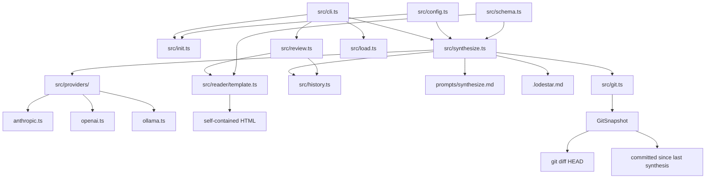
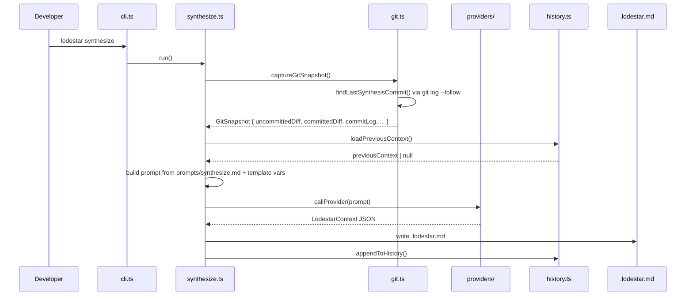
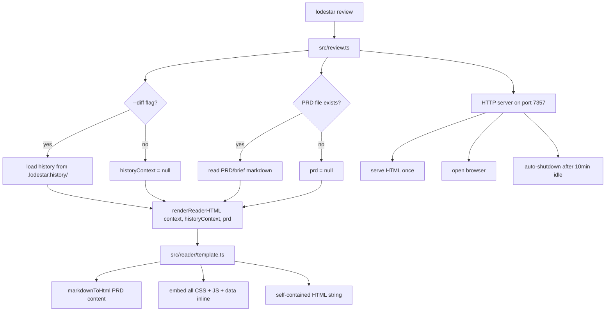

# Lodestar Context

> Project: lodestar
> Date: 2025-07-25
> Model: claude-opus-4-5
> Session Duration: unknown

## Project Summary

Lodestar is a CLI + MCP tool that synthesizes coding session context into a structured .lodestar.md file, enabling AI assistants and developers to resume sessions with full context. It captures git diffs, decisions, patterns, and open questions across sessions, and provides a browser-based reader for reviewing session history.

**User Segments:**
- Solo founders using AI coding tools
- Developers working with AI pair programmers (Claude, Cursor, Copilot)
- First-time app builders who lose context between sessions

## Integrations

No integrations detected.

## Project Brief Status

- [-] **lodestar init — first-run CLI wizard** — 90% — Implemented with provider selection, key validation, config creation, retry on invalid directory, and skip-prompt-if-valid-config. Minor open question about npm publish readiness.
- [-] **lodestar synthesize — two-diff session synthesis** — 75% — Two-diff architecture implemented in git.ts and synthesize.ts. futurePhases field added to schema.ts and prompts/synthesize.md but still uncommitted. Critical integration question about committedDiff/commitLog threading still unverified end-to-end.
- [-] **lodestar load — structured context loader** — 60% — File exists per directory structure but no session diff coverage to confirm implementation completeness.
- [-] **lodestar review — browser-based session reader** — 75% — Core committed previously. This session adds: markdownToHtml() custom renderer in template.ts, futurePhases field in schema.ts, PRD panel rendering in HTML output, and optional prd parameter to renderReaderHTML(). All changes still uncommitted across template.ts, schema.ts, review.ts, and prompts/synthesize.md.
- [ ] **lodestar diff — drift detection** — 0% — Phase 1b stub only per CLAUDE.md. Do not implement.

## Future Phases

### Phase 1b

Drift detection and diff tooling
- lodestar diff — detect drift between current codebase state and last synthesis

## Diagrams

### System Architecture [architecture]

### Synthesize Flow [sequence]

### Review Reader Flow [flow]

## Decisions

### Added futurePhases array to LodestarContext schema

**Rationale:** The synthesize prompt now outputs planned future work as structured data rather than burying it in decisions or open questions. This allows the reader to surface upcoming phases distinctly from current feature status, and gives future sessions a clear roadmap view.
**Files:** src/schema.ts, prompts/synthesize.md

### markdownToHtml() implemented as a custom inline renderer in template.ts rather than importing a markdown library

**Rationale:** The reader page is fully self-contained with no external dependencies. Importing a markdown library (marked, markdown-it) would either require bundling or a CDN call, both of which violate the self-contained HTML constraint. The custom renderer handles the subset of markdown needed for PRD content (headers, bold, italic, code, lists, tables, blockquotes, hr, paragraphs).
**Files:** src/reader/template.ts

### renderReaderHTML() now accepts an optional prd parameter of type { filename: string; content: string } | null

**Rationale:** lodestar review can optionally render a project brief/PRD file alongside the synthesis context. Making it optional with a null default preserves backward compatibility — callers that don't have a PRD still work. The PRD content is converted from markdown to HTML via markdownToHtml() before embedding.
**Files:** src/reader/template.ts, src/review.ts

### CSS class prefix 'prd-' used for all PRD panel styles

**Rationale:** Namespacing prevents style collisions between PRD-rendered markdown and the existing reader UI elements which have their own class conventions.
**Files:** src/reader/template.ts

### lodestar review is a short-lived local HTTP server, not a persistent dev server

**Rationale:** Single-use pattern: spin up, open browser, serve once, auto-shutdown after 10 minutes idle or Ctrl+C. Avoids port conflicts, resource leaks, and user confusion about background processes.
**Files:** src/review.ts, CLAUDE.md

### The HTML reader page is fully self-contained — served as a single string from src/reader/template.ts with all CSS and JS inline

**Rationale:** Works offline, no CDN calls from served page, no build step for the reader, no external dependencies at runtime.
**Files:** src/reader/template.ts

### Progressive disclosure implemented at three levels in the reader

**Rationale:** Users need to assess session context at different depths — quick orientation before starting work vs. deep reconstruction of decisions.
**Files:** src/reader/template.ts

### Diff panel in reader computes semantic deltas rather than raw text diffs

**Rationale:** Raw git diff of .lodestar.md is noisy JSON. Semantic comparison surfaces what actually changed in human terms.
**Files:** src/reader/template.ts

### Synthesis now captures two distinct diffs: uncommitted changes and committed changes since last synthesis

**Rationale:** Developers who commit frequently mid-session were losing committed work from synthesis — the old single git diff HEAD only showed unstaged/staged changes.
**Files:** src/git.ts, src/synthesize.ts, prompts/synthesize.md

### Last synthesis anchor point determined by finding most recent commit that touched .lodestar.md via git log --follow

**Rationale:** The .lodestar.md file itself is the natural anchor. No separate state file or tagged commits required.
**Files:** src/git.ts

### When no prior synthesis exists, fall back to showing the last 20 commits as context

**Rationale:** First-run experience: a brand new project has no anchor commit so the committed diff would be empty.
**Files:** src/git.ts

### projectRoot is optional in MCP tools, defaulting to cwd

**Rationale:** Primary use case is an AI assistant calling tools from within the project directory. Requiring explicit path adds friction.
**Files:** src/index.ts

### Init flow skips API key prompt when an existing config is already valid

**Rationale:** Re-running lodestar init to reconfigure tool integrations should not force re-entry of a working API key.
**Files:** src/init.ts

## Patterns

- **Provider abstraction under src/providers/ directory — each provider gets its own file (anthropic.ts, openai.ts, ollama.ts) with a unified interface** — src/providers/
- **Entry points compile to dist/*.js — cli.ts → dist/cli.js, init.ts → dist/init.js, index.ts → dist/index.js** — package.json scripts and bin field
- **History stored in .lodestar.history/ at working directory root, gitignored** — .gitignore, src/history.ts
- **Prompts stored as markdown files in prompts/ directory and loaded at runtime with {{variable_name}} template substitution** — prompts/synthesize.md, src/synthesize.ts
- **Configuration separated into src/config.ts — not inlined into individual modules** — src/config.ts
- **.lodestar.md serves dual purpose: human-readable context document AND anchor marker for determining what changed since last synthesis** — src/git.ts, findLastSynthesisCommit()
- **GitResult discriminated union returned from captureGitSnapshot — callers check result type before accessing snapshot fields** — src/git.ts, src/synthesize.ts
- **Self-contained HTML reader pattern: all CSS, JS, and data inline in a single string export from src/reader/template.ts — no external files, no CDN, no build step for the reader** — src/reader/template.ts, src/review.ts
- **CLI commands loaded lazily via dynamic import() in cli.ts switch statement — avoids loading all command modules on every invocation** — src/cli.ts
- **Semantic diff computed by Set-based key comparison (d.decision, d.package, q.question, p.pattern) rather than index-based or text-based diff** — src/reader/template.ts, renderDiffPanel()
- **CSS class prefix namespacing for feature-scoped styles — 'prd-' prefix for all PRD panel styles to prevent collision with existing reader UI styles** — src/reader/template.ts, markdownToHtml()
- **Optional parameters with null defaults on renderReaderHTML() preserve backward compatibility when adding new display capabilities** — src/reader/template.ts

## Dependencies

No dependency changes recorded.

## Rejected Approaches

### Using a markdown library (marked, markdown-it) for PRD content rendering in the reader

**Reason:** Would require either bundling the library into the self-contained HTML string or making a CDN call from the served page. Both violate the no-external-dependencies constraint. A custom inline renderer for the required markdown subset is sufficient.

### Using only git diff HEAD (uncommitted changes) as the sole input to synthesis

**Reason:** Developers who commit mid-session lose all committed work from synthesis. A session with 5 commits and no uncommitted changes would produce an empty diff, generating a useless synthesis.

### Persistent web server or cloud-hosted UI for lodestar review

**Reason:** Explicitly out of scope per CLAUDE.md. A short-lived local server is sufficient and avoids port conflicts, background processes, and infrastructure requirements.

### External CDN dependencies or separate CSS/JS files for the review reader

**Reason:** Requires network access, adds complexity, breaks offline usage. Self-contained single-string HTML is simpler and more robust.

### WebSocket or SSE live reload in the review server

**Reason:** Explicitly rejected per spec. The reader is single-use, not a dev server. Live reload adds complexity for zero user benefit.

## Open Questions

- [BLOCKING] Does markdownToHtml() in template.ts have a bug where markdown symbols (*, #, backticks) are HTML-escaped by escapeHtml() BEFORE the markdown regexes run, causing the regexes to never match? This is a likely implementation defect that would silently produce unrendered markdown in PRD panels.
- [BLOCKING] Does src/synthesize.ts correctly thread committedDiff and commitLog from GitSnapshot into the {{committed_diff}} and {{commit_log}} prompt template variables? This is the critical integration point for the two-diff architecture and has not been verified end-to-end.
- [BLOCKING] Are all five uncommitted files (template.ts, schema.ts, review.ts, synthesize.ts, prompts/synthesize.md) mutually consistent? Specifically: does schema.ts have the futurePhases type, does prompts/synthesize.md output futurePhases, does template.ts render a PRD panel, and does review.ts pass prd correctly to renderReaderHTML()?
- [non-blocking] Is the lodestar review --diff flag fully wired? It requires loading previous context from .lodestar.history/ — does src/review.ts call history.ts correctly and is historyContext non-null when history exists?
- [non-blocking] What port conflict behavior does src/review.ts implement? CLAUDE.md spec says 'prefer 7357, fallback to any open port' — is this implemented with a try/bind retry loop?
- [non-blocking] The 10-minute idle auto-shutdown in review.ts — is idle defined as no HTTP requests, or no browser tab open? What's the actual implementation?
- [non-blocking] The findLastSynthesisCommit function — if the developer commits .lodestar.md in the same commit as code changes, the committedDiff will exclude that commit's code changes. Is this intended or an off-by-one?
- [non-blocking] The README references npm link for installation but the package isn't published to npm yet — is there a plan for npm publish, and does package.json have the right 'files' field to exclude dev artifacts?

## Next Session

- FIRST: Run npm run build immediately against all 5 dirty files — if it fails, nothing else matters. The futurePhases type in schema.ts, the new renderReaderHTML() signature in template.ts, and the callers in review.ts and synthesize.ts must all be consistent before proceeding.
- SECOND: Audit the markdownToHtml() function in template.ts for the escapeHtml()-before-regex bug — if escapeHtml() runs before markdown regex matching, characters like *, #, and backticks become HTML entities and no markdown will render. This is the highest-probability silent defect in the current uncommitted work.
- THIRD: Run lodestar synthesize on this project, then lodestar review, and verify the PRD panel renders in the browser with real markdown content — this is the end-to-end smoke test that validates the entire in-flight changeset (schema + prompt + template + server) as a coherent unit.
- FOURTH: After smoke test passes, commit all 5 dirty files together as a single atomic commit — they are interdependent and must not be committed piecemeal (schema change + prompt change + template change + server change + lodestar.md update).
- CONTEXT: The src/providers/anthropic.ts and src/providers/openai.ts are also listed as modified in git status but were not mentioned in session notes — inspect these changes before committing to understand what changed there.
